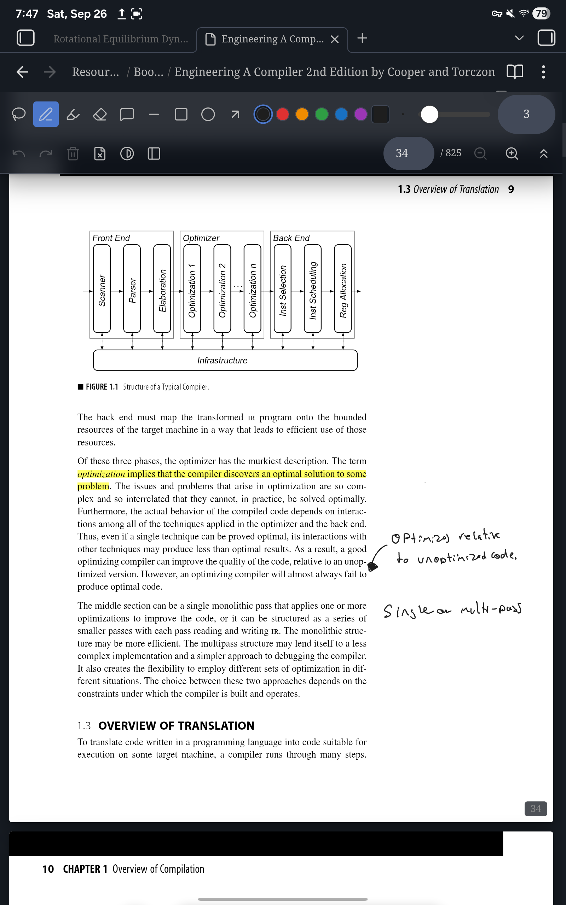
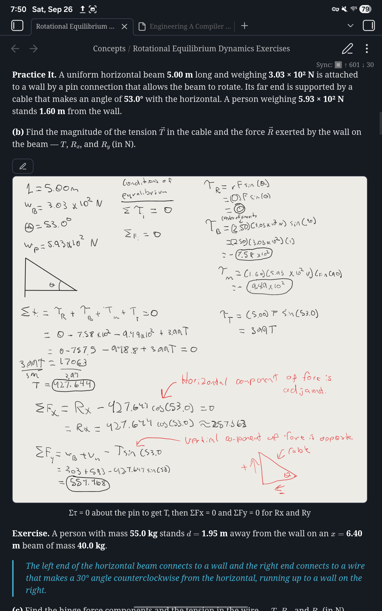

# Inkling

Handwritten and text annotation for PDFs and Markdown notes in Obsidian,
built mobile-first for stylus input.

Inkling exists for one reason: **the knowledge stays in the vault.** Xodo
and GoodNotes are excellent PDF annotators, and if annotating the PDF were
the point you should use one of them. The point is that a highlight in a
textbook becomes a searchable, linkable Markdown note sitting beside
everything else you know — without leaving the app you keep it all in.

<p>
  
  
</p>

Videos: [writing on a textbook page](docs/demo-materials/writing.mp4) ·
[extracting annotations to a note](docs/demo-materials/extracting-annotations.mp4)

## What it does

**Annotate PDFs.** Pen, highlighter, eraser, shapes, and lasso selection,
over any PDF in your vault. Ink is written into the file as real PDF
annotations, so it shows up in Obsidian's own reader, in Xodo, in Acrobat —
anywhere.

**Feels like ink.** Every stylus sample is captured, not just the one per
frame the browser volunteers; strokes are curve-fitted rather than joined
with straight lines; and a pen that reports pressure draws a stroke that
tapers with it.

**Highlights become notes.** Drag the highlighter over text and it snaps to
the lines it swept — and remembers the words it covered. "Extract
annotations to a note" turns those into Markdown, grouped by page, each
entry linking back to `[[book.pdf#page=42]]` and carrying a block reference
so you can link to one specific highlight.

That works retroactively, on highlights made before you installed this and
on highlights made in other PDF software: the match is geometric, so
anything with a rectangle over text can have its quote recomputed.

**Comments.** Tap with the note tool, type, and it commits as a standard
PDF sticky note — which means other readers show it too.

**Handwritten notes.** Create a blank, lined, or dot-grid PDF and write
straight into it, adding pages as you fill them.

**Ink blocks in Markdown.** A ```` ```inkling ```` block is a drawing
surface inside an ordinary note, for a diagram in the middle of a page of
typing. "Insert ink annotation block" leaves a three-line fence in the note
and keeps the strokes in an `.ink` file beside your other attachments, one
per note, so the note stays readable and small. Where those files go is a
setting.

**Getting around.** Outline, page jump, find-in-document, per-page zoom
(pinch, Ctrl+wheel, or the toolbar), a collapsible toolbar, and dark-mode
page inversion that darkens the page without touching the colour of your
ink.

## Keyboard

Inside the annotate view:

| Key | Action |
|---|---|
| `s` `p` `h` `e` | Select, pen, highlighter, eraser |
| `l` `r` `o` `a` | Line, rectangle, oval, arrow |
| `1`–`6` | Preset colours |
| `[` `]` | Thinner, thicker |
| `Delete` | Delete selection |
| `Mod+Z` / `Mod+Shift+Z` | Undo / redo |
| `PageUp` / `PageDown` | Previous / next page |
| `Mod+=` / `Mod+-` / `Mod+0` | Zoom in / out / reset |

Undo and redo are also palette commands, so you can bind them globally.

## Installing

Not in the community catalogue yet. Install with
[BRAT](https://github.com/TfTHacker/obsidian42-brat):

1. Install BRAT from Community Plugins.
2. **Add Beta Plugin**, and give it this repository.
3. Enable **Inkling** in Community Plugins.

Or manually: download `main.js`, `manifest.json` and `styles.css` from a
release into `<vault>/.obsidian/plugins/inkling/`.

## Mobile and stylus

Built mobile-first, and tested on a Samsung tablet with an S Pen.

- **Palm rejection.** Pen and mouse draw; touch scrolls and pinch-zooms.
  Touch panning is hand-rolled rather than left to the browser, because
  relying on `touch-action` let a downward pen stroke get taken over
  mid-draw on real hardware.
- **Pressure and tilt.** Pressure varies stroke width where the stylus
  reports it.
- **No desktop-only APIs.** Everything runs on mobile.

## Limitations

**Some PDFs open read-only, on purpose.** Inkling rewrites a PDF through
`pdf-lib`, and before it will do that it checks the document two ways: it
compares `pdf-lib`'s reading of the file against `pdf.js`'s, and it looks
for interactive forms and digital signatures. If the two readers disagree,
or the document has a form or a signature, the book renders and its
existing annotations display but drawing is turned off, with a banner
saying why. Filling in a form and saving it through here would lose the
form; re-serializing a signed document invalidates the signature.

**Some PDFs are rewritten whole on every save.** Most saves append only
what changed to the end of the file — a kilobyte or two, however large the
book — so sync uploads the change rather than the textbook. A file whose
structure Inkling cannot safely append to is rewritten whole instead, and
for those it scales how often it saves to the file's size: ten seconds
under 5 MB, thirty up to 25 MB, a minute above. Either way, every save is
verified against the document it came from before a byte is written.

**Extraction is one-directional.** Editing an extracted note does not
change the PDF.

**Ink blocks render only inside Obsidian**, so a note holding one is less
portable than one holding an image.

**Renaming or moving an `.ink` file breaks its blocks, for now.** The fence
names the file by path, and nothing rewrites it yet, so the blocks show a
read-only "missing" banner and never save over anything. Move the file
back and they return. Renaming or moving the *note* is fine. Blocks made
by earlier versions, with their strokes inside the note, keep working
exactly as they did.

## Development

```bash
npm install
npm run dev     # watch build
npm test        # vitest
npm run lint
npm run build   # type-check and production bundle
```

`pdf-lib` and `pdfjs-dist` are pinned to exact versions for reasons
recorded at the top of `src/pdfView.ts`. Don't bump them without reading
that comment.

Design documents and implementation plans live in `docs/superpowers/`.

## License

MIT — see [LICENSE](LICENSE).
